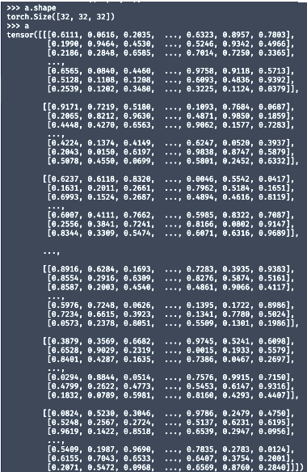

# libtensor

## 1. 基础功能

### 1.1 基础方法
- 支持`size()`, `type()`, `data_ptr()`等基础方法。

### 1.2 基础创建方法
- 给定初始化：
  - `ts::Tensor t = ts::tensor(T data[]);`
  - 例如：`t = ts::tensor([[1,2],[3,4]]);`
- 创建随机、零、单位矩阵等：
  - `ts::rand<T>(int size[]);`
  - `ts::zeros<T>(int size[]);`
  - `ts::ones<T>(int size[]);`
  - `ts::eye<T>(int size[]);`

## 2. 计算操作

### 2.1 索引
- 索引和切片操作：
  - `ts::Tensor t = ts::tensor(T data[]);`
  - `ts::Tensor t1 = t(1); // 第二个元素`
  - `ts::Tensor t2 = t(2,{2,4}); // 第三维的第三至第五个元素（不包括第五个）`

```cpp
// 示例
ts::Tensor t = ts::tensor([[0.1, 1.2, 3.4, 5.6, 7.8], [2.2, 3.1, 4.5, 6.7, 8.9], [4.9, 5.2, 6.3, 7.4, 8.5]]);
std::cout << t(1) << std::endl << t(2,{2,4}) << std::endl;
// 输出
[ 2.2000, 3.1000, 4.5000, 6.7000, 8.9000]
[ 6.3000, 7.4000]
```

### 2.2 Joining操作
- 连接操作：
    - ts::Tensor t3 = ts::cat({t1, t2}, int dim); //沿给定维度连接t1和t2
```cpp
ts::Tensor t1 = ts::tensor(T data1[]);
ts::Tensor t2 = ts::tensor(T data2[]);
ts::Tensor t3 = ts::cat({t1, t2}, int dim); // 沿指定维度连接t1和t2
ts::Tensor t4 = ts::tile(t1, int dims[]); // 重复t1元素构造t4

// 示例
ts::Tensor t1 = ts::tensor([[0.1, 1.2], [2.2, 3.1], [4.9, 5.2]]);
ts::Tensor t2 = ts::tensor([[0.2, 1.3], [2.3, 3.2], [4.8, 5.1]]);

std::cout << ts::cat({t1, t2}, 0) << std::endl << ts::cat({t1, t2}, 1) << std::endl << ts::tile(t1, {2, 2}) << std::endl;
// 输出
[[ 0.1000, 1.2000],
 [ 2.2000, 3.1000],
 [ 4.9000, 5.2000],
 [ 0.2000, 1.3000],
 [ 2.3000, 3.2000],
 [ 4.8000, 5.1000]]
[[ 0.1000, 1.2000, 0.2000, 1.3000],
 [ 2.2000, 3.1000, 2.3000, 3.2000],
 [ 4.9000, 5.2000, 4.8000, 5.1000]]
[[ 0.1000, 1.2000, 0.1000, 1.2000],
 [ 2.2000, 3.1000, 2.2000, 3.1000],
 [ 4.9000, 5.2000, 4.9000, 5.2000],
 [ 0.1000, 1.2000, 0.1000, 1.2000],
 [ 2.2000, 3.1000, 2.2000, 3.1000],
 [ 4.9000, 5.2000, 4.9000, 5.2000]]
 ```

 ### 2.3 Mutating操作

 ```cpp
ts::Tensor t = ts::tensor(T data[]);
t(1) = 1; // 将t的第二个元素设置为1
t(2, {2, 4}) = [1, 2]; // 将t的第三维度的第三到第五个元素（不包括第五个）设置为[1, 2]

// 示例
ts::Tensor t = ts::tensor([[0.1, 1.2, 3.4, 5.6, 7.8], [2.2, 3.1, 4.5, 6.7, 8.9], [4.9, 5.2, 6.3, 7.4, 8.5]]);
t(1) = 1;
t(2, {2, 4}) = {1, 2};
std::cout << t << std::endl;
// 输出
[[ 0.1000, 1.2000, 3.4000, 5.6000, 7.8000],
 [ 1.0000, 1.0000, 1.0000, 1.0000, 1.0000],
 [ 4.9000, 5.2000, 1.0000, 2.0000, 8.5000]]
 ```

### 2.4 Transpose和Permute操作

```cpp
ts::Tensor t = ts::tensor(T data[]);
ts::Tensor t1 = ts::transpose(t, int dim1, int dim2); // 沿指定维度转置tensor t
ts::Tensor t2 = t.transpose(int dim1, int dim2); // 另一种转置tensor t的方式
ts::Tensor t3 = ts::permute(t, int dims[]); // 根据给定维度排列tensor t
ts::Tensor t4 = t.permute(int dims[]); // 另一种排列tensor t的方式

// 示例
ts::Tensor t = ts::tensor([[0.1, 1.2, 3.4, 5.6, 7.8], [2.2, 3.1, 4.5, 6.7, 8.9], [4.9, 5.2, 6.3, 7.4, 8.5]]);
std::cout << ts::transpose(t, 0, 1) << std::endl << ts::permute(t, [1, 0]) << std::endl;
// 输出
[[ 0.1000, 2.2000, 4.9000],
 [ 1.2000, 3.1000, 5.2000],
 [ 3.4000, 4.5000, 6.3000],
 [ 5.6000, 6.7000, 7.4000],
 [ 7.8000, 8.9000, 8.5000]]
[[ 0.1000, 2.2000, 4.9000],
 [ 1.2000, 3.1000, 5.2000],
 [ 3.4000, 4.5000, 6.3000],
 [ 5.6000, 6.7000, 7.4000],
 [ 7.8000, 8.9000, 8.5000]]
```

### 2.5 View操作
```cpp
ts::Tensor t = ts::tensor(T data[]);
ts::Tensor t3 = ts::view(t, int shape[]); // This views the tensor t according to
the given shape.
ts::Tensor t4 = t.view(int shape[]); // Another way to view the tensor t.


// Example
ts::Tensor t = ts::tensor([[0.1, 1.2, 3.4, 5.6, 7.8], [2.2, 3.1, 4.5, 6.7, 8.9],
[4.9, 5.2, 6.3, 7.4, 8.5]]);
std::cout << ts::view(t, [5, 3]) << std::endl << t.view([1, 15]) << std::endl;
// Output
[[ 0.1000, 1.2000, 3.4000],
 [ 5.6000, 7.8000, 2.2000],
 [ 3.1000, 4.5000, 6.7000],
 [ 8.9000, 4.9000, 5.2000],
 [ 6.3000, 7.4000, 8.5000]]
[[ 0.1000, 1.2000, 3.4000, 5.6000, 7.8000, 2.2000, 3.1000, 4.5000, 6.7000,
8.9000, 4.9000, 5.2000, 6.3000, 7.4000, 8.5000]]
```

## 3 数学计算
### 3.1 Pointwise计算，如add,sub,div,mul,log
```cpp
ts::Tensor t1 = ts::tensor(T data1[]);
ts::Tensor t2 = ts::tensor(T data2[]);
ts::Tensor t3 = ts::add(t1, t2); // This adds t1 and t2 element-wise.
ts::Tensor t4 = t1.add(t2); // Another way to add t1 and t2 element-wise.
ts::Tensor t5 = t1 + t2; // Another way to add t1 and t2 element-wise.
ts::Tensor t6 = ts::add(t1, T value); // This adds t1 and a scalar value elementwise.
ts::Tensor t7 = t1.add(T value); // Another way to add t1 and a scalar value
element-wise.
// ... Similar for sub, mul, div, log.

// Example
ts::Tensor t1 = ts::tensor([[0.1, 1.2], [2.2, 3.1], [4.9, 5.2]]);
ts::Tensor t2 = ts::tensor([[0.2, 1.3], [2.3, 3.2], [4.8, 5.1]]);
std::cout << t1 + t2 << std::endl << ts::add(t1, 1) << std::endl;
// Output
[[ 0.3000, 2.5000],
 [ 4.5000, 6.3000],
 [ 9.7000, 10.3000]]
[[ 1.1000, 2.2000],
 [ 3.2000, 4.1000],
 [ 5.9000, 6.2000]]
 ```

 ### 3.2 Reduction计算，如sum,mean,max,min
 ```cpp
 ts::Tensor t = ts::tensor(T data[]);
ts::Tensor t1 = ts::sum(t, int dim);// This sums the tensor t along the given
dimension.
ts::Tensor t2 = t.sum(int dim);// Another way to sum the tensor t along the given
dimension.
// ... Similar for mean, max, min.

// Example
ts::Tensor t = ts::tensor([[0.1, 1.2], [2.2, 3.1], [4.9, 5.2]]);
std::cout << ts::sum(t, 0) << std::endl << t.sum(1) << std::endl;
// Output
[ 7.2000, 9.5000]
[ 1.3000, 5.3000, 10.1000]
```
### 3.3 Comparison计算，如gt,lt,ge,le,eq,ne
```cpp
ts::Tensor t1 = ts::tensor(T data1[]);
ts::Tensor t2 = ts::tensor(T data2[]);
ts::Tensor<bool> t3 = ts::eq(t1, t2);// This compares t1 and t2 element-wise.
ts::Tensor t4<bool> = t1.eq(t2);// Another way to compare t1 and t2 element-wise.
ts::Tensor t5<bool> = t1 == t2;// Another way to compare t1 and t2 element-wise.
// ... Similar for ne, gt, ge, lt, le.

// Example
ts::Tensor t1 = ts::tensor([[0.1, 1.2], [2.2, 3.1], [4.9, 5.2]]);
ts::Tensor t2 = ts::tensor([[0.2, 1.3], [2.2, 3.2], [4.8, 5.2]]);
std::cout << (t1 == t2) << std::endl;
// Output
[[ False, False],
 [ True, False],
 [ False, True]]
```

### 3.4 Einsum魔法计算
```cpp
ts::Tensor t1 = ts::tensor(T data1[]);
ts::Tensor t2 = ts::tensor(T data2[]);
ts::Tensor t3 = ts::einsum("i,i->", t1, t2); // This computes the dot product of t1
and t2.
ts::Tensor t4 = ts::einsum("i,i->i", t1, t2); // This computes the element-wise
product of t1 and t2.
ts::Tensor t5 = ts::einsum("ii->i", t1); // This computes the diagonal of t1.
ts::Tensor t6 = ts::einsum("i,j->ij", t1, t2); // This computes the outer product of
t1 and t2.
ts::Tensor t7 = ts::einsum("bij,bjk->bik", t1, t2); // This computes the batch
matrix multiplication of t1 and t2.

// Example
ts::Tensor t1 = ts::tensor([1, 2, 3]);
ts::Tensor t2 = ts::tensor([4, 5, 6]);
std::cout << ts::einsum("i,i->", t1, t2) << std::endl << ts::einsum("i,i->i", t1,
t2) << std::endl;
// Output
32
[ 4, 10, 18]

```

## 4 附加分

### 4.1 序列化
```cpp 
ts::Tensor t = ts::tensor(T data[]);
ts::save(t, string filename); // This saves the tensor t to the given file.
ts::Tensor t1 = ts::load(string filename); // This loads the tensor t from the given
file.
std::cout << t << std::endl; // This should pretty-print the tensor t
```


### 4.2 运算加速，如CUDA,MKL,SIMD,OpenMP

### 4.3 Gradient图支持

### 4.4 OTHERS